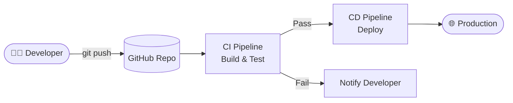
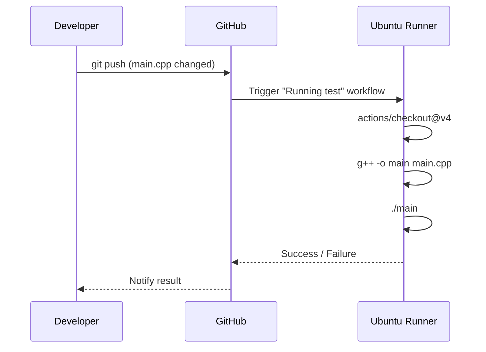
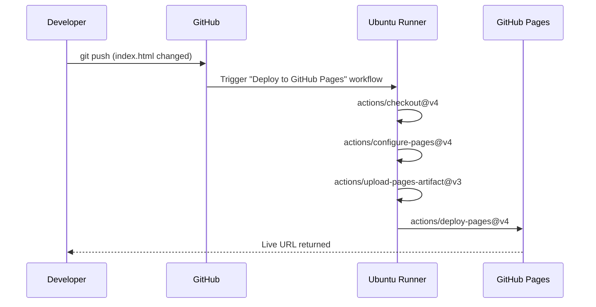
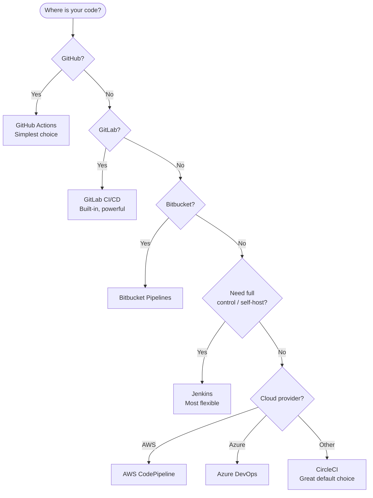

# Learn CI/CD with GitHub Actions

A hands-on project for learning Continuous Integration and Continuous Deployment (CI/CD) concepts using **GitHub Actions**. This repo includes two workflows: one that compiles and runs a C++ program, and another that deploys a static HTML page to GitHub Pages.

---

## What is CI/CD?

**CI (Continuous Integration)** automatically builds and tests your code every time you push changes, catching bugs early.

**CD (Continuous Deployment/Delivery)** automatically delivers your tested code to a target environment — staging or production — with little to no manual intervention.



---

## This Project's Workflows

### 1. CI — Compile & Run C++ (`test.yml`)

Triggered on every push that modifies `main.cpp`. It compiles the file with `g++` and runs the binary to verify correctness.



### 2. CD — Deploy to GitHub Pages (`deploy.yml`)

Triggered on every push that modifies `index.html` (or manually via `workflow_dispatch`). It packages the site and deploys it to GitHub Pages.



---

## Project Structure

```
.
├── .github/
│   └── workflows/
│       ├── test.yml       # CI: compile & run C++
│       └── deploy.yml     # CD: deploy to GitHub Pages
├── main.cpp               # C++ source file
├── index.html             # Static HTML page
└── README.md
```

---

## Alternative CI/CD Platforms

GitHub Actions is not the only option. Here is how the major platforms compare:

| Platform                | Hosting             | Free Tier   | Best For                   |
| ----------------------- | ------------------- | ----------- | -------------------------- |
| **GitHub Actions**      | Cloud (GitHub)      | Yes         | GitHub-native projects     |
| **GitLab CI/CD**        | Cloud + Self-hosted | Yes         | GitLab repos, self-hosting |
| **CircleCI**            | Cloud + Self-hosted | Yes         | Fast parallelism, Docker   |
| **Jenkins**             | Self-hosted         | Open source | Full control, enterprise   |
| **Travis CI**           | Cloud               | Limited     | Open-source projects       |
| **Bitbucket Pipelines** | Cloud (Atlassian)   | Yes         | Bitbucket + Jira teams     |
| **Azure DevOps**        | Cloud (Microsoft)   | Yes         | .NET / Azure ecosystem     |
| **AWS CodePipeline**    | Cloud (AWS)         | Limited     | AWS-native deployments     |

### Platform Decision Tree



### How a Jenkins Pipeline Looks (Comparison)

The same CI/CD flow written in a `Jenkinsfile` (declarative syntax) instead of GitHub Actions YAML:

```groovy
pipeline {
    agent any
    stages {
        stage('Checkout') {
            steps { checkout scm }
        }
        stage('Build') {
            steps { sh 'g++ -o main main.cpp' }
        }
        stage('Test') {
            steps { sh './main' }
        }
        stage('Deploy') {
            steps { sh './deploy.sh' }
        }
    }
}
```

### How a GitLab CI Pipeline Looks (Comparison)

The equivalent `.gitlab-ci.yml`:

```yaml
stages:
  - build
  - test
  - deploy

build:
  stage: build
  script:
    - g++ -o main main.cpp

test:
  stage: test
  script:
    - ./main

deploy:
  stage: deploy
  script:
    - ./deploy.sh
  only:
    - main
```

---

## Key Concepts

| Term               | Meaning                                                         |
| ------------------ | --------------------------------------------------------------- |
| **Workflow**       | An automated process defined in a YAML file                     |
| **Job**            | A group of steps that run on the same runner                    |
| **Step**           | A single task (shell command or reusable Action)                |
| **Runner**         | The virtual machine that executes the job                       |
| **Action**         | A reusable unit of automation (e.g. `actions/checkout@v4`)      |
| **Trigger (`on`)** | The event that starts a workflow (push, PR, schedule, manual)   |
| **Artifact**       | Files produced by a job and passed to subsequent jobs or stored |
| **Environment**    | A deployment target with optional protection rules              |

---

## Getting Started

1. Fork or clone this repository.
2. Push a change to `main.cpp` to trigger the CI workflow.
3. Push a change to `index.html` to trigger the CD workflow.
4. View workflow runs under the **Actions** tab in your GitHub repository.
